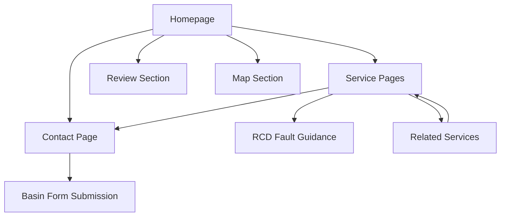

# Dr. Watts Electrical Services - Product Requirements Document

## 1. Product Overview

Dr. Watts Electrical Services Ltd requires a modern, high-performing website to replace their current basic site and establish a professional brand presence in the Auckland electrical services market. The new website will focus on lead generation, SEO optimization, and projecting an established company image rather than a "one-man band" perception.

The primary goal is to create a static website optimized for GitHub Pages hosting that maximizes lead conversion through strategic CTAs while showcasing comprehensive electrical services across Auckland, New Zealand.

## 2. Core Features

### 2.1 User Roles

No user registration or role distinction required - all visitors are potential customers with identical access to information and contact capabilities.

### 2.2 Feature Module

Our Dr. Watts website consists of the following main pages:

1. **Homepage**: Hero section with company branding, prominent review showcase from multiple platforms, permanent map section, strategic CTAs, and service overview
2. **Switchboard Upgrades**: Dedicated service page detailing safety benefits, RCD integration, surge protection, and compliance requirements
3. **LED Lighting Upgrades**: Service page highlighting energy efficiency, cost savings, safety improvements, and environmental benefits
4. **Electrical Services for New Builds**: Comprehensive page covering complete electrical solutions for new residential construction projects
5. **Renovation Electrical Services**: Service page for electrical upgrades during home renovations and remodeling projects
6. **Fault Finding & Repairs**: Diagnostic and repair services page with troubleshooting guidance and professional solutions
7. **RCD Safety Switch Fault Guidance**: Educational page providing step-by-step troubleshooting instructions for RCD issues
8. **Contact Page**: Comprehensive contact information, service area map, and Basin-powered contact form

### 2.3 Page Details

| Page Name | Module Name | Feature Description |
|-----------|-------------|--------------------|
| Homepage | Hero Section | Display company logo, tagline, primary CTA button, and professional imagery showcasing electrical work |
| Homepage | Review Showcase | Integrate and display reviews from Builderscrack, Instagram, Facebook, and No Cowboys.co.nz with star ratings and testimonials |
| Homepage | Service Overview | Grid layout featuring all electrical services with brief descriptions and links to dedicated pages |
| Homepage | Map Section | Permanent embedded map showing Auckland service area with location markers and coverage zones |
| Homepage | Contact CTAs | Multiple strategically placed contact buttons, phone numbers, and quick quote request forms |
| Service Pages | Service Details | Comprehensive service descriptions, benefits, safety information, and compliance details |
| Service Pages | Process Overview | Step-by-step explanation of service delivery process and what customers can expect |
| Service Pages | CTA Integration | Service-specific contact forms, quote requests, and phone call buttons |
| Service Pages | Related Services | Cross-promotion of complementary electrical services with internal linking |
| Contact Page | Contact Form | Basin-powered form with spam protection, auto-responses, and lead routing capabilities |
| Contact Page | Business Information | Complete contact details, business hours, service areas, and professional certifications |
| Contact Page | Interactive Map | Detailed map with service coverage areas, office location, and contact information overlay |
| All Pages | SEO Optimization | Meta tags, structured data, local SEO elements, and Auckland-focused keyword optimization |
| All Pages | Mobile Responsiveness | Touch-optimized interface, responsive design, and mobile-first approach for all devices |

## 3. Core Process

**Visitor Journey Flow:**
Potential customers typically arrive via search engines or referrals, land on the homepage where they view services and reviews, navigate to specific service pages for detailed information, and ultimately contact Dr. Watts through multiple available channels including phone, contact form, or direct inquiry buttons.

**Lead Generation Process:**
Visitors discover services → Review testimonials and credentials → Access detailed service information → Engage with strategically placed CTAs → Submit contact forms or call directly → Receive prompt professional response

## 4. User Interface Design

### 4.1 Design Style

- **Primary Colors**: Derived from Dr. Watts logo color palette (to be extracted from `/Users/anthonyxiao/Dev/Esperion/drwatts/dr-datts-logo.png`)
- **Secondary Colors**: Professional blues and grays to convey trust and reliability
- **Button Style**: Modern rounded buttons with subtle shadows and hover effects
- **Typography**: Clean, professional sans-serif fonts (Roboto or similar) with clear hierarchy
- **Layout Style**: Card-based design with clean white space, professional grid layouts, and mobile-first responsive approach
- **Icons**: Electrical-themed icons, safety symbols, and professional service indicators

### 4.2 Page Design Overview

| Page Name | Module Name | UI Elements |
|-----------|-------------|-------------|
| Homepage | Hero Section | Full-width banner with logo, professional tagline, primary CTA button, and background image of electrical work |
| Homepage | Review Showcase | Card-based layout with star ratings, customer photos, review text, and platform logos (Builderscrack, Facebook, etc.) |
| Homepage | Service Grid | 3-column responsive grid with service icons, brief descriptions, and "Learn More" buttons |
| Homepage | Map Section | Embedded Google Maps with custom markers, service area overlay, and contact information popup |
| Service Pages | Content Layout | Two-column layout with service images, detailed descriptions, benefit lists, and sidebar CTAs |
| Service Pages | Process Steps | Numbered step indicators with icons, descriptions, and visual progress flow |
| Contact Page | Form Design | Clean form layout with validation, Basin integration, and professional styling |
| All Pages | Navigation | Sticky header with logo, main navigation menu, phone number, and emergency contact button |
| All Pages | Footer | Company information, service links, contact details, and professional certifications |

### 4.3 Responsiveness

Mobile-first responsive design optimized for touch interactions, with breakpoints at 768px (tablet) and 1024px (desktop). All CTAs and contact elements are touch-optimized for mobile users, ensuring seamless lead generation across all devices.