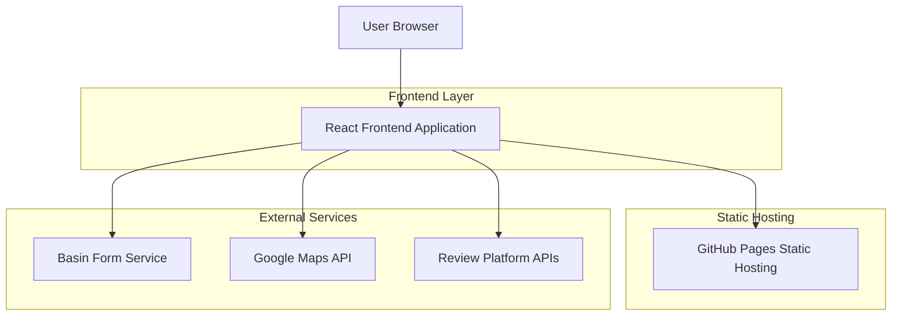
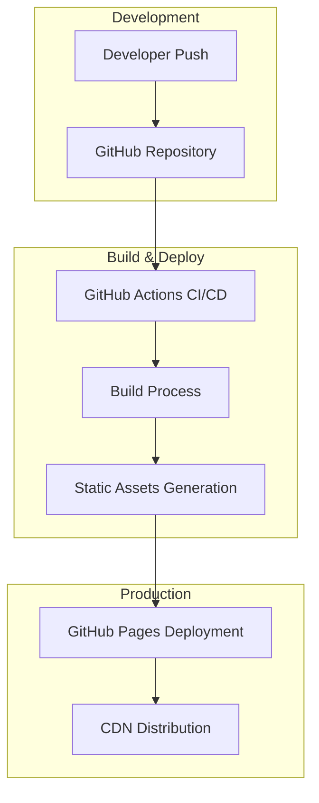
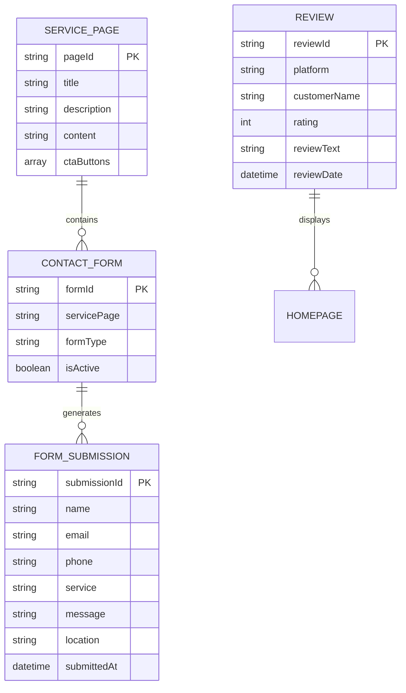

# Dr. Watts Electrical Services - Technical Architecture Document

## 1. Architecture Design



## 2. Technology Description

- Frontend: React@18 + TypeScript + Tailwind CSS@3 + Vite
- Hosting: GitHub Pages (Static Site)
- Form Handling: Basin.com API
- Maps: Google Maps JavaScript API
- Build Tool: Vite with GitHub Actions for CI/CD

## 3. Route Definitions

| Route | Purpose |
|-------|----------|
| / | Homepage with hero section, reviews, services overview, and map |
| /services/switchboard-upgrades | Dedicated page for switchboard upgrade services |
| /services/led-lighting | LED lighting upgrade services and benefits |
| /services/new-builds | Electrical services for new construction projects |
| /services/renovations | Electrical services for home renovations |
| /services/fault-finding | Diagnostic and repair services |
| /services/rcd-guidance | RCD safety switch troubleshooting guide |
| /contact | Contact information, form, and service area map |
| /about | Company information and professional certifications |

## 4. API Definitions

### 4.1 Core API Integrations

**Basin Form Submission**
```
POST https://usebasin.com/f/{FORM_ID}
```

Request:
| Param Name | Param Type | isRequired | Description |
|------------|------------|------------|-------------|
| name | string | true | Customer full name |
| email | string | true | Customer email address |
| phone | string | true | Customer phone number |
| service | string | true | Requested electrical service |
| message | string | false | Additional details or questions |
| location | string | true | Service location in Auckland |

Response:
| Param Name | Param Type | Description |
|------------|------------|-------------|
| success | boolean | Form submission status |
| message | string | Confirmation or error message |

Example Request:
```json
{
  "name": "John Smith",
  "email": "john@example.com",
  "phone": "021 123 4567",
  "service": "Switchboard Upgrade",
  "message": "Need urgent switchboard replacement",
  "location": "Auckland CBD"
}
```

**Google Maps Integration**
```
GET https://maps.googleapis.com/maps/api/js?key={API_KEY}&libraries=places
```

Used for:
- Service area visualization
- Location-based service requests
- Interactive map on homepage and contact page

**Review Platform Integration**
- Builderscrack API (if available) or manual content management
- Facebook Graph API for public reviews
- Instagram Basic Display API for testimonials
- No Cowboys.co.nz (manual integration or web scraping)

## 5. Server Architecture Diagram

As this is a static site hosted on GitHub Pages, there is no traditional server architecture. The deployment flow is:



## 6. Data Model

### 6.1 Data Model Definition

Since this is a static site, data is managed through:



### 6.2 Static Data Structure

Data is managed through JSON files and React components:

**Services Configuration (services.json)**
```json
{
  "services": [
    {
      "id": "switchboard-upgrades",
      "title": "Switchboard Upgrades",
      "description": "Enhance safety and reliability with modern switchboard installations",
      "features": ["RCD Integration", "Surge Protection", "Arc Fault Detection"],
      "ctaText": "Contact The Doctor for Switchboard Upgrade",
      "estimatedDuration": "4-8 hours",
      "compliance": "NZ Electrical Standards"
    }
  ]
}
```

**Reviews Configuration (reviews.json)**
```json
{
  "reviews": [
    {
      "id": "review-001",
      "platform": "Builderscrack",
      "customerName": "Sarah M.",
      "rating": 5,
      "reviewText": "Excellent service, professional and reliable",
      "date": "2024-01-15",
      "verified": true
    }
  ]
}
```

**Contact Configuration (contact.json)**
```json
{
  "contact": {
    "phone": "09 XXX XXXX",
    "email": "info@drwatts.co.nz",
    "address": "Auckland, New Zealand",
    "serviceAreas": ["Auckland CBD", "North Shore", "West Auckland"],
    "businessHours": {
      "monday": "7:00 AM - 6:00 PM",
      "emergency": "24/7 Emergency Service Available"
    },
    "basinFormId": "YOUR_BASIN_FORM_ID"
  }
}
```

**SEO Configuration (seo.json)**
```json
{
  "seo": {
    "siteName": "Dr Watts Electrical Services Ltd",
    "baseUrl": "https://drwatts.github.io",
    "defaultTitle": "Professional Electrician Auckland | Dr Watts Electrical Services",
    "defaultDescription": "Trusted electrical services in Auckland. Switchboard upgrades, LED lighting, new builds, renovations. Licensed electricians.",
    "keywords": ["electrician auckland", "electrical services", "switchboard upgrade", "LED lighting"],
    "localBusiness": {
      "name": "Dr Watts Electrical Services Ltd",
      "address": "Auckland, New Zealand",
      "phone": "09 XXX XXXX",
      "serviceArea": "Auckland, New Zealand"
    }
  }
}
```